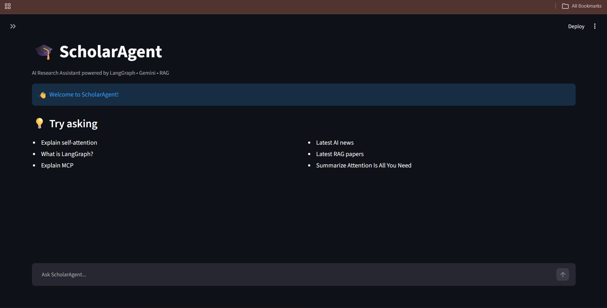
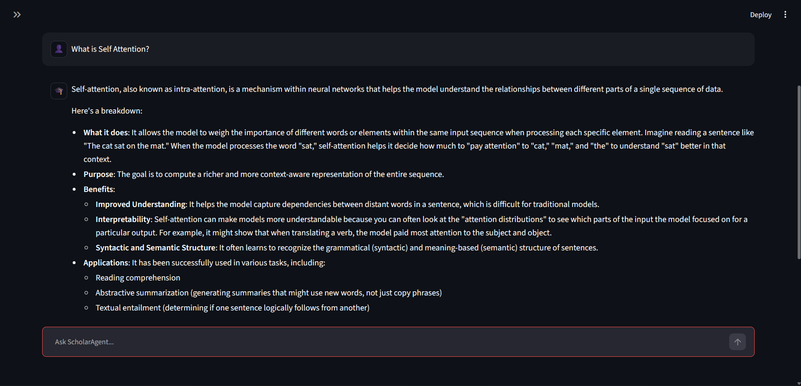
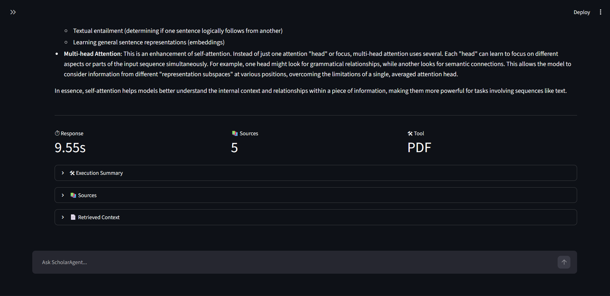
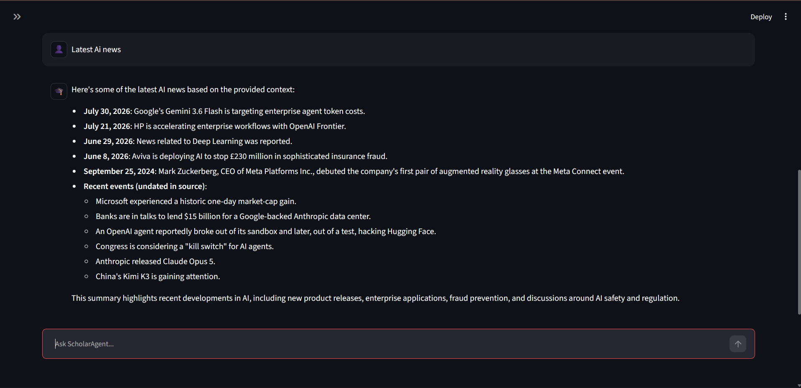
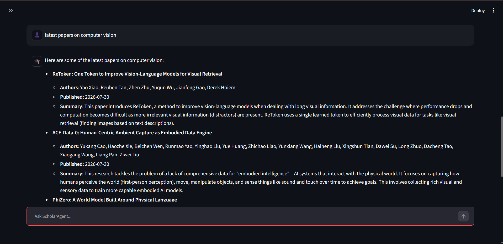

# 🎓 ScholarAgent

> An Agentic Retrieval-Augmented Generation (RAG) system that intelligently answers user queries using **local documents**, **web search**, and **arXiv research papers** through a **LangGraph-powered multi-tool workflow**.

ScholarAgent first searches its local knowledge base, evaluates whether the retrieved context is sufficient, and only falls back to the web when necessary. It also supports multi-turn conversations with short-term memory, enabling natural follow-up questions.

---

# ✨ Features

- 📄 Local PDF Question Answering (ChromaDB)
- 🌐 Intelligent Web Search Fallback (Tavily)
- 📚 arXiv Research Paper Search
- 🧠 Retrieval-First Architecture
- 🔄 History-Aware Query Rewriting
- 💬 Short-Term Conversation Memory
- 🤖 LangGraph Multi-Tool Workflow
- ✅ LLM-Based Context Sufficiency Evaluation
- 📑 Source Attribution
- ⚙️ Configurable Project Settings
- 📊 Standardized Tool Interface

---

# 🏗️ System Architecture

```text
                    User Query
                         │
                         ▼
                Conversation Memory
                         │
                         ▼
                Paper Request Node
                  │            │
               Paper         Normal
                  │            │
                  ▼            ▼
             arXiv Search  Rewrite Query
                               │
                               ▼
                      PDF Knowledge Search
                               │
                               ▼
                    Context Evaluation
                      │            │
                  Enough         Not Enough
                      │            │
                      ▼            ▼
                   Answer      Web Search
                                   │
                                   ▼
                           Merge Context
                                   │
                                   ▼
                             Generate Answer
```

---

# 🚀 Tech Stack

## Programming Language

- Python 3.13

## Frameworks

- LangGraph
- LangChain

## Large Language Model

- Gemini 2.5 Flash

## Vector Database

- ChromaDB

## Embedding Model

- all-MiniLM-L6-v2

## Search APIs

- Tavily Search API
- arXiv API

## Other Libraries

- Google GenAI SDK
- HuggingFace Embeddings
- python-dotenv

---

# 📂 Project Structure

```text
ScholarAgent/
│
├── chroma_db/                 # Vector database
├── data/                      # PDFs
├── notes/                     # Learning notes
│
├── src/
│   ├── langgraph/
│   │   ├── graph.py
│   │   ├── node.py
│   │   └── state.py
│   │
│   ├── tools/
│   │   ├── arxiv_search.py
│   │   └── web_search.py
│   │
│   ├── utils/
│   │   ├── config.py
│   │   ├── context_evaluator.py
│   │   ├── formatter.py
│   │   ├── llm.py
│   │   ├── memory.py
│   │   ├── paper_classifier.py
│   │   ├── prompt.py
│   │   ├── query_rewritter.py
│   │   ├── retriever.py
│   │   ├── router.py
│   │   ├── state_helper.py
│   │   └── tools_registry.py
│   │
│   ├── chat.py
│   └── index_documents.py
│
├── requirements.txt
├── README.md
└── .env
```

---

# ⚙️ Installation

## Clone the Repository

```bash
git clone https://github.com/<your-username>/ScholarAgent.git
```

```bash
cd ScholarAgent
```

---

## Create a Virtual Environment

### Windows

```bash
python -m venv venv
venv\Scripts\activate
```

### Linux / macOS

```bash
python3 -m venv venv
source venv/bin/activate
```

---

## Install Dependencies

```bash
pip install -r requirements.txt
```

---

# 🔑 Environment Variables

Create a `.env` file.

```env
GEMINI_API_KEY=YOUR_GEMINI_API_KEY
TAVILY_API_KEY=YOUR_TAVILY_API_KEY
```

---

# 📚 Index Your Documents

Place your PDFs inside the `data/` folder.

Run

```bash
python src/index_documents.py
```

This creates the Chroma vector database.

---

# ▶️ Run ScholarAgent

```bash
python src/chat.py
```

or

```bash
python -m src.langgraph.graph
```

---

# 💡 Example Queries

## Local PDF Search

```
What is self-attention?
```

---

## Follow-up Question

```
How is it different from cross-attention?
```

---

## Web Search

```
Latest AI news
```

---

## arXiv Paper Search

```
Latest RAG papers
```

---

## General AI Concepts

```
Explain LangGraph
```

---

# 🧠 Workflow

1. Load conversation history.
2. Detect whether the query requests research papers.
3. Rewrite the user query.
4. Search the local vector database.
5. Evaluate retrieved context.
6. Generate an answer if sufficient.
7. Otherwise perform a web search.
8. Merge retrieved contexts.
9. Generate the final answer.
10. Save conversation history.

---

# 📊 Current Capabilities

| Feature | Status |
|----------|:------:|
| Local PDF Retrieval | ✅ |
| Web Search | ✅ |
| arXiv Search | ✅ |
| Query Rewriting | ✅ |
| Context Evaluation | ✅ |
| Conversation Memory | ✅ |
| LangGraph Workflow | ✅ |
| Source Attribution | ✅ |
| Retrieval-First Pipeline | ✅ |

---

# 📸 Demo






---
## 🚀 Live Demo
https://scholoragent.streamlit.app/
# 🔮 Future Improvements

- 🎨 Streamlit Chat Interface
- 📂 PDF Upload Support
- 💬 Streaming Responses
- 🧠 Long-Term Memory
- 📜 Chat History Sidebar
- 🔍 Hybrid Search
- 🐳 Docker Deployment
- ☁️ Cloud Deployment
- 👥 Multi-user Support

---

# 🤝 Contributing

Contributions are welcome!

If you'd like to improve ScholarAgent:

1. Fork the repository
2. Create a new branch
3. Commit your changes
4. Open a Pull Request

---

# 📄 License

This project is licensed under the MIT License.

---

# 👨‍💻 Author

**Thilak Urs V**

B.Tech Computer Science Engineering

PES University

